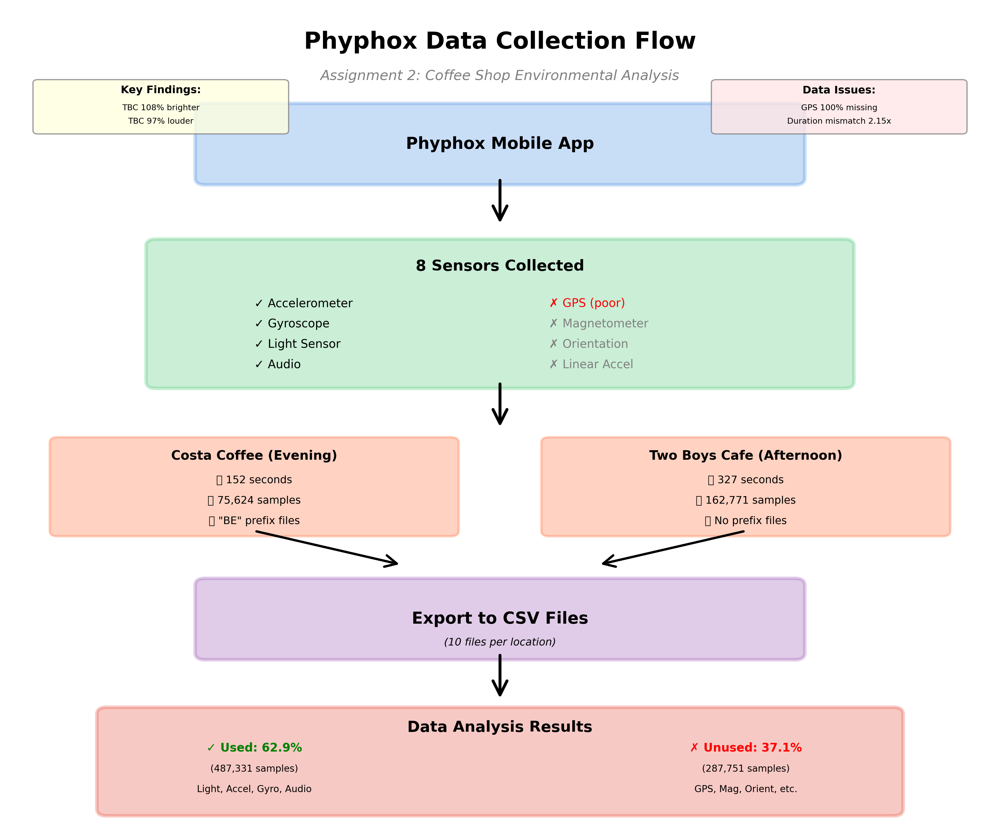
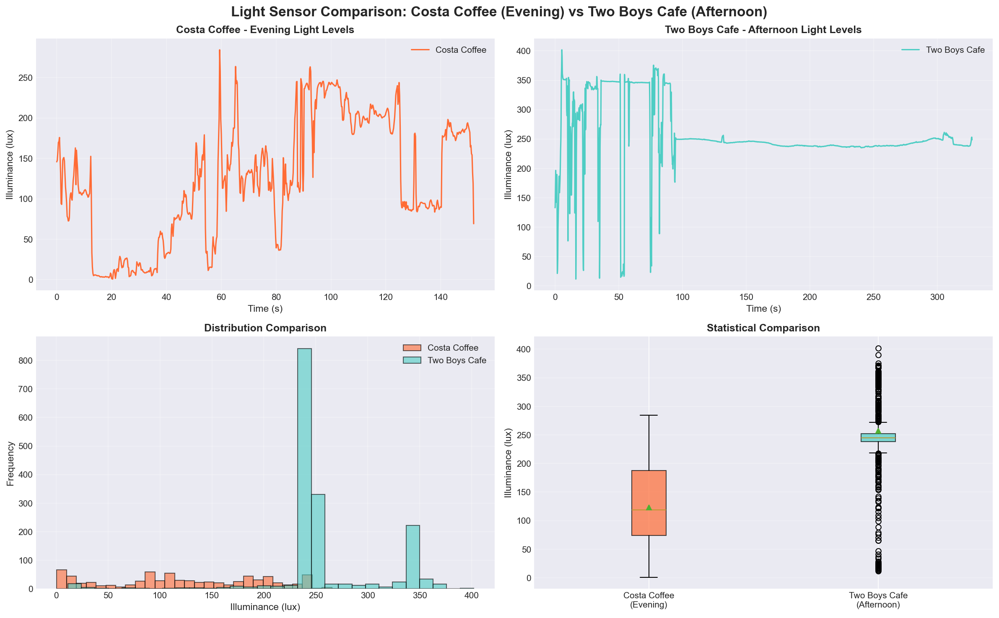
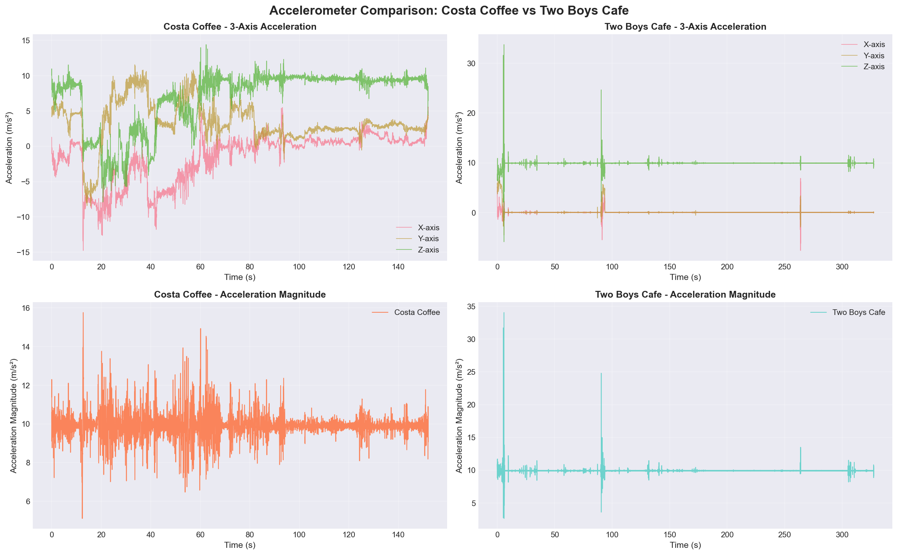
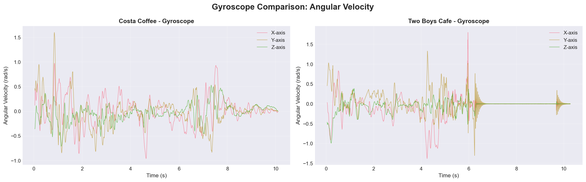
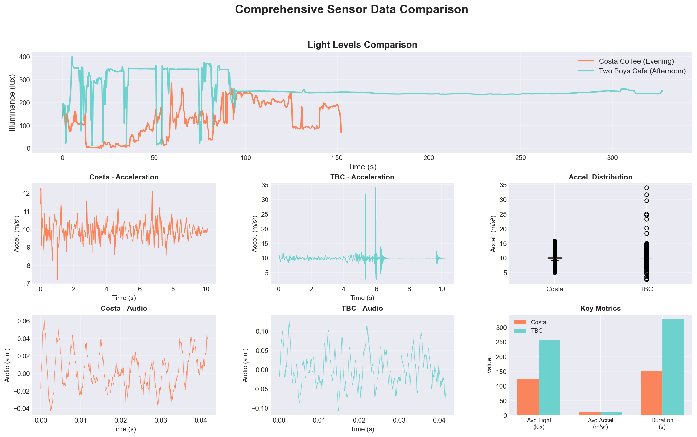

# CS7NS4 Assignment 2: Urban Data Collection

**Date:** October 24, 2025

---

This report presents sensor data collected from two coffee shop locations in Dublin using the Phyphox mobile application. The data collection was conducted as preparation for Assignment 4, where I plan to analyze **Local Commerce Traffic Flow** to identify walk-by potential for local businesses. For this initial data gathering exercise, I selected two cafes—Costa Coffee and Two Boys Cafe—to collect baseline environmental sensor data at different times of day. The goal was to understand the environmental characteristics of each location and practice multi-sensor data collection techniques that will later be applied to pedestrian traffic analysis.

---

## Technical Approach

The data collection utilized **Phyphox** (Physics Phone Experiments), a mobile application designed for physics experiments that provides access to multiple smartphone sensors simultaneously. The application allows high-frequency sensor recording and exports data in structured CSV format, making it suitable for urban sensing applications.

The smartphone was placed in a stable position at each location, and all sensors were configured to record simultaneously for several minutes. Data was then exported via Phyphox's built-in web interface, which generates separate CSV files for each sensor type. The complete workflow is illustrated below:

**Figure 1:** Data collection workflow showing the progression from app configuration through sensor recording to CSV export.

### Sensors Collected

Eight different smartphone sensors were recorded during each data collection session:

| Sensor | Sampling Rate | Purpose |
|--------|--------------|---------|
| Accelerometer | 500 Hz | Measures 3-axis motion and device movement |
| Gyroscope | 500 Hz | Measures rotational movement in 3D space |
| Light Sensor | ~2 Hz | Measures ambient brightness levels |
| Audio | 48 kHz | Captures ambient sound through microphone |
| GPS | Variable | Records location coordinates |
| Magnetometer | 500 Hz | Measures magnetic field strength |
| Orientation | 500 Hz | Tracks device orientation in space |
| Linear Acceleration | 500 Hz | Measures motion with gravity removed |

Data was collected from **Costa Coffee** in the evening (around 18:00-19:00) for approximately 2.5 minutes, and from **Two Boys Cafe** in the afternoon (around 13:00-14:00) for approximately 5.5 minutes. Both locations are in Dublin city center.

### Sample Data

Below is a representative sample of the audio sensor data collected from both locations:

| Time (seconds) | Sound Level | Location |
|----------------|-------------|----------|
| 0.000000 | -0.017242 | Costa Coffee |
| 0.000021 | -0.010864 | Costa Coffee |
| 0.000042 | -0.007874 | Costa Coffee |
| 0.000063 | -0.004150 | Costa Coffee |
| 0.000083 | -0.003021 | Costa Coffee |
| 0.000104 | 0.000061 | Costa Coffee |
| 0.000125 | 0.001404 | Costa Coffee |
| 0.000000 | -0.016754 | Two Boys Cafe |
| 0.000021 | -0.016266 | Two Boys Cafe |
| 0.000042 | -0.017670 | Two Boys Cafe |
| 0.000063 | -0.019379 | Two Boys Cafe |
| 0.000083 | -0.019470 | Two Boys Cafe |
| 0.000104 | -0.019470 | Two Boys Cafe |
| 0.000125 | -0.017456 | Two Boys Cafe |

The audio sensor captures ambient sound at 48,000 samples per second. The complete dataset includes over 775,000 sensor readings across all eight sensors from both locations.

---

## Data Challenges

### Imperfection Issues

The GPS sensor data exhibited significant imperfection problems, particularly with uncertainty and incompleteness. At Costa Coffee, critical fields like altitude, velocity, and direction were completely missing—100% of the 9 GPS readings contained no usable data for these measurements. Even at Two Boys Cafe, where 322 GPS samples were collected, the direction field was entirely absent. This uncertainty made it impossible to analyze movement patterns or altitude changes. Additionally, the GPS data suffered from vagueness, with horizontal accuracy readings as poor as 100 meters at Costa Coffee, making the location data too imprecise for any detailed spatial analysis. The first few GPS readings at Two Boys Cafe were also incomplete, missing height and velocity information entirely.

The light sensor demonstrated granularity issues, sampling at only 2 Hz compared to the motion sensors' 500 Hz rate. This created a temporal mismatch between different sensor streams, making it difficult to synchronize events across sensors. GPS updates were even more irregular, occurring anywhere from 1 to 20 seconds apart, further complicating time-aligned analysis across the sensor suite.

### Inconsistency Problems

The Two Boys Cafe accelerometer data contained notable outliers in its sampling pattern. While most readings came at the expected 2-millisecond intervals (500 Hz), there were two instances where gaps exceeded 10 milliseconds, with the largest gap reaching 177 milliseconds—88 times slower than expected. These outliers indicated system interruptions, possibly from the phone's operating system backgrounding the app or battery optimization interfering with data collection.

A significant disorder issue emerged in the collection duration. Two Boys Cafe's session lasted 327 seconds while Costa Coffee's lasted only 152 seconds—a 2.15x difference. This imbalance meant that Two Boys Cafe ended up with 162,771 accelerometer samples compared to Costa Coffee's 75,624 samples. The unequal dataset sizes introduced statistical bias when comparing averages and made temporal pattern analysis more challenging.

### Disparateness Challenges

The eight different sensors operated at vastly different sampling rates, units, and scales, creating a multi-source data integration challenge. The accelerometer recorded at 500 Hz with values in meters per second squared, the light sensor at 2 Hz in brightness units, and GPS at irregular intervals in degrees and meters. Attempting to fuse or synchronize these disparate data streams would require significant temporal resampling and normalization.

Furthermore, not all collected sensors were relevant to the research question. The magnetometer, which measures magnetic fields for compass functionality, provided no useful information about the coffee shop environment. Similarly, the orientation sensor tracked how the phone was positioned rather than any environmental characteristic. Linear acceleration was redundant since it's mathematically derived from the raw accelerometer data. Audio FFT and peak detection files added complexity without meaningful value for a simple ambient noise comparison. In total, 287,751 sensor readings—37% of all collected data—turned out to be irrelevant to analyzing the coffee shop environments.

---

## How Challenges Were Addressed

For the uncertainty and incompleteness in GPS data, I excluded all GPS-derived metrics from the analysis. Instead of attempting to work with the unreliable altitude, velocity, and direction fields, I focused only on the basic latitude and longitude coordinates for coarse location tagging. The coffee shop names and manually recorded visit times provided more reliable context than the incomplete sensor data.

To handle the granularity mismatch between sensors, I analyzed each sensor independently at its native sampling rate rather than attempting synchronization. Statistical aggregations like averages and medians were calculated within each sensor type, avoiding the complications of cross-sensor time alignment. This approach preserved the integrity of each data stream while still enabling meaningful comparisons.

For sampling rate outliers, I documented the gaps but chose not to interpolate or fill them. Preserving the authentic data, gaps and all, seemed more appropriate for understanding real-world collection challenges. Additionally, using robust statistics like median alongside mean helped mitigate the influence of any anomalous samples.

The duration mismatch was addressed through normalization. Rather than comparing raw totals, I converted all metrics to per-second rates and used percentages for comparisons. For example, average brightness per second rather than total brightness collected. This made the unequal session lengths less problematic for statistical comparison.

Finally, to handle the disparateness of irrelevant sensors, I performed a focused selection analysis. Only four sensors were deemed relevant to environmental comparison: light (ambient brightness), accelerometer (activity/movement), gyroscope (rotational patterns), and audio (ambient noise). The other four sensors—GPS, magnetometer, orientation, and linear acceleration—were excluded from the analysis entirely, reducing the dataset by 37% but improving focus and relevance.

---

## Data Analysis Results

### Brightness Comparison

**Figure 2:** Brightness levels measured at both locations over time.

Two Boys Cafe measured significantly brighter than Costa Coffee. The afternoon cafe averaged 257 units of brightness compared to Costa's evening measurement of 123 units—roughly 109% brighter. This difference aligns with expectations, as afternoon locations benefit from natural daylight through windows, while evening locations rely primarily on artificial lighting. The maximum brightness at Two Boys Cafe reached 402 units versus Costa's peak of 284 units.

### Movement and Activity

**Figure 3:** Motion sensor measurements showing device movement patterns.

The motion sensors revealed nearly identical patterns at both locations. Average movement measured 9.90 at Costa Coffee and 9.91 at Two Boys Cafe—essentially no difference. This similarity likely reflects that the phone remained stationary on a table at both locations, capturing only ambient vibrations and minor table movements rather than significant environmental differences.

### Ambient Noise

**Figure 4:** Sound level recordings from both locations.

Two Boys Cafe was considerably noisier than Costa Coffee. The afternoon cafe measured an average sound level of 0.040 compared to Costa's 0.020—approximately 97% louder. This substantial difference suggests higher customer activity, more conversation, or generally more ambient activity during the afternoon hours at Two Boys Cafe compared to the quieter evening atmosphere at Costa Coffee.

### Rotation Patterns

**Figure 5:** Rotational movement captured by the gyroscope sensor.

Both locations showed minimal rotational movement, indicating the device remained in a stable position throughout recording. The gyroscope data confirmed that the phone was not being handled or moved during the data collection sessions.

### Overall Comparison

**Figure 6:** Combined view of all sensor measurements for both locations.

The comprehensive comparison reveals that the most significant environmental difference between the two locations was brightness (109% higher at Two Boys Cafe) and noise level (97% higher at Two Boys Cafe), while movement patterns remained essentially identical. These findings suggest that time of day and customer activity levels are the primary distinguishing factors between the two coffee shop environments.

---

**End of Report**
