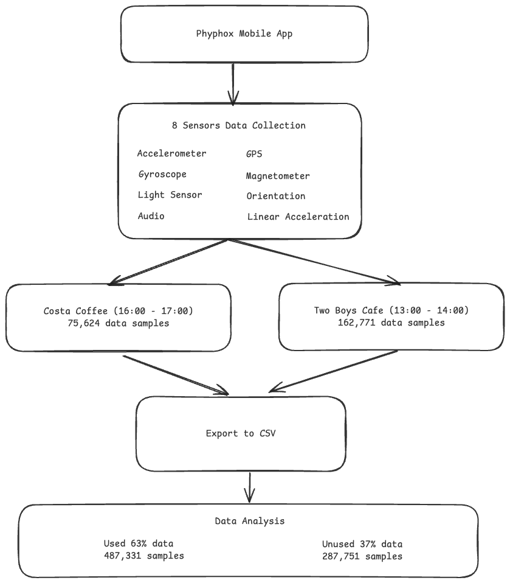
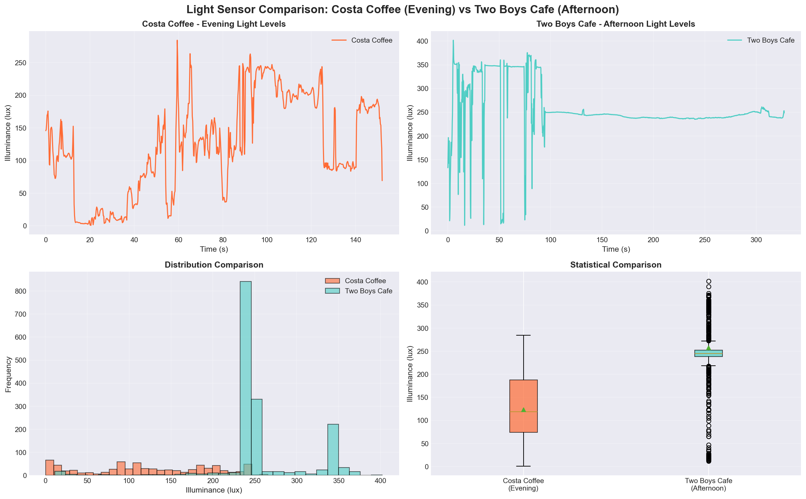
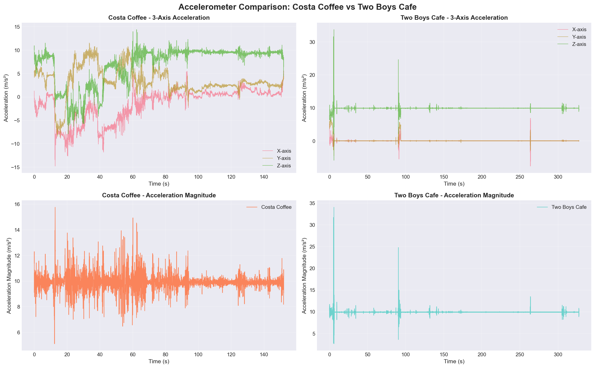
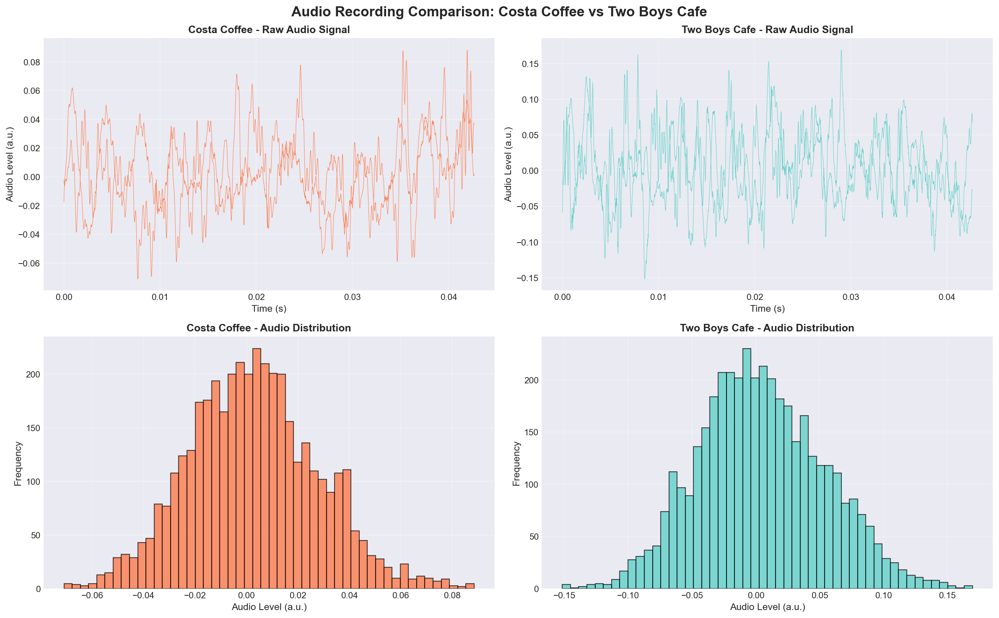
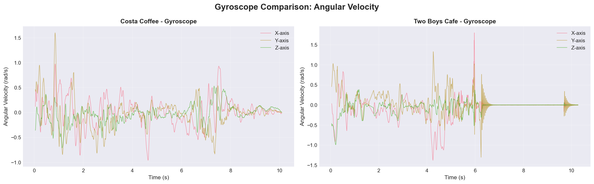
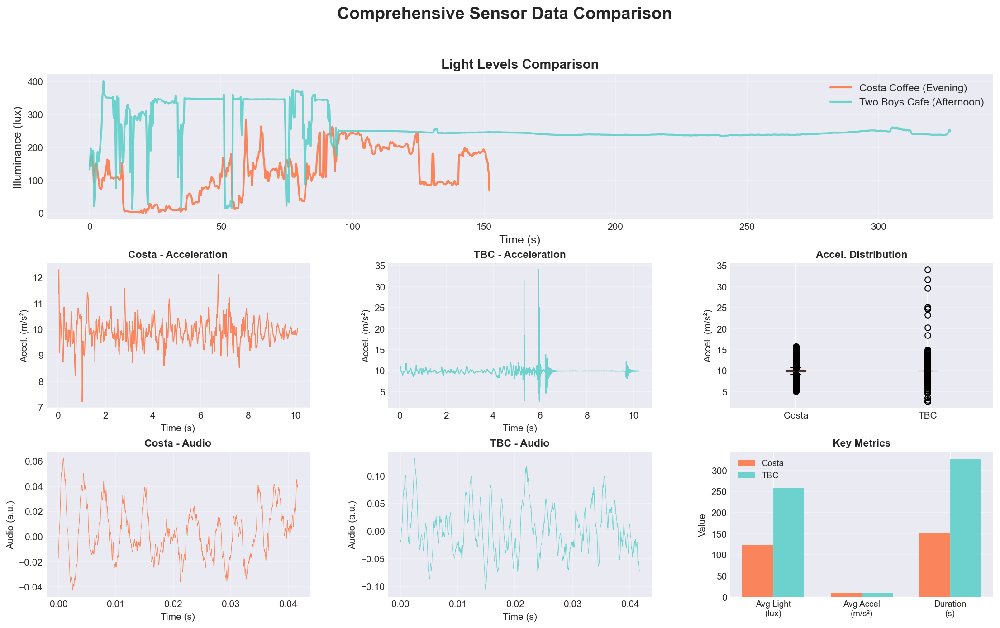

# CS7NS4 Assignment 2

**Name:** Sayan Mondal
**Student ID:** 24377372
**Course:** MSc Computer Science, Future Networked Systems

---

For this assignment I have collected sensor data from two businesses (two coffee shops in my case) locations in Dublin using an open source mobile application called Phyphox. I collected this data as a preparation step for the final assignment 4, where I plan to analyze local commerce traffic flow near a certain businesses to identify their walk-by potential for local businesses. I chose two cafes, Costa Coffee opposite Trinity College Dublin and Two Boys Cafe in north Phibsborough to collect baseline environmental sensor data at different times of day. I wanted to understand the environmental characteristics during different hours , potentially seggregating quiet hours with busy hours based on different locations and businesses, and practice multi-sensor data collection techniques that will later be applied to pedestrian traffic analysis.

## Technical Approach

I used utilized **Phyphox** (Physics Phone Experiments) for data collection, its a mobile application designed for physics experiments that provides access to multiple smartphone sensors simultaneously. This app makes it possible to record high frequency senor data and exports the data in a structured CSV format, it makes it suitable for collecting data easily that'd be required later.

The data was captured using my smartphone, placed at each location for a while as it recorded the data for several minutes. Data was then exported via Phyphox's built-in web interface, which generates separate CSV files for each sensor type. The complete technical diagram is illustrated below:

**Figure 1:** Data collection workflow showing the progression from app configuration through sensor recording to CSV export.

### Sensors Collected

Eight different sensors were used to record the different data for each session:

| Sensor | Sampling Rate | Purpose |
|--------|--------------|---------|
| Accelerometer | 500 Hz | Measures 3-axis motion and device movement |
| Gyroscope | 500 Hz | Measures rotational movement in 3D space |
| Light Sensor | ~2 Hz | Measures ambient brightness levels |
| Audio | 48 kHz | Captures ambient sound through microphone |
| GPS | Variable | Records location coordinates |
| Magnetometer | 500 Hz | Measures magnetic field strength |
| Orientation | 500 Hz | Tracks device orientation in space |
| Linear Acceleration | 500 Hz | Measures motion with gravity removed |

Data was collected from **Costa Coffee** in the evening (from 17:00-18:00) at 1 Dawson St, Dublin 2, D02 RW08, and from **Two Boys Cafe** in the afternoon (from 13:00-14:00) at 375 N Circular Rd, Phibsborough, Dublin 7, D07 FWY1.

### Sample Data

Below is a representative sample of the audio sensor data collected from both locations:

| Time (seconds) | Sound Level | Location |
|----------------|-------------|----------|
| 0.000000 | -0.017242 | Costa Coffee |
| 0.000021 | -0.010864 | Costa Coffee |
| 0.000042 | -0.007874 | Costa Coffee |
| 0.000063 | -0.004150 | Costa Coffee |
| 0.000083 | -0.003021 | Costa Coffee |
| 0.000104 | 0.000061 | Costa Coffee |
| 0.000125 | 0.001404 | Costa Coffee |
| 0.000000 | -0.016754 | Two Boys Cafe |
| 0.000021 | -0.016266 | Two Boys Cafe |
| 0.000042 | -0.017670 | Two Boys Cafe |
| 0.000063 | -0.019379 | Two Boys Cafe |
| 0.000083 | -0.019470 | Two Boys Cafe |
| 0.000104 | -0.019470 | Two Boys Cafe |
| 0.000125 | -0.017456 | Two Boys Cafe |

Below is a representative sample of the brightness sensor data collected from both locations:

| Time (seconds) | Illuminance (lx) | Location |
|----------------|------------------|----------|
| 0.008770 | 145.76 | Costa Coffee |
| 0.208762 | 147.50 | Costa Coffee |
| 0.408783 | 157.66 | Costa Coffee |
| 0.608764 | 169.78 | Costa Coffee |
| 0.808775 | 170.73 | Costa Coffee |
| 1.008760 | 175.86 | Costa Coffee |
| 0.000000 | 132.95 | Two Boys Cafe |
| 0.085396 | 134.95 | Two Boys Cafe |
| 0.285393 | 168.24 | Two Boys Cafe |
| 0.485403 | 196.44 | Two Boys Cafe |
| 0.685388 | 142.13 | Two Boys Cafe |
| 0.885402 | 161.70 | Two Boys Cafe |

Below is a representative sample of the magnetometer sensor data collected from both locations:

| Time (seconds) | Magnetic Field X (µT) | Magnetic Field Y (µT) | Magnetic Field Z (µT) | Location |
|----------------|----------------------|----------------------|----------------------|----------|
| 0.053516 | 10.28 | 10.04 | -30.90 | Costa Coffee |
| 0.063516 | 10.14 | 10.21 | -30.96 | Costa Coffee |
| 0.073516 | 10.16 | 10.21 | -30.95 | Costa Coffee |
| 0.083516 | 10.22 | 10.27 | -31.06 | Costa Coffee |
| 0.081039 | -15.14 | -36.53 | -19.58 | Two Boys Cafe |
| 0.091039 | -14.99 | -36.77 | -19.67 | Two Boys Cafe |
| 0.101039 | -14.68 | -37.10 | -19.98 | Two Boys Cafe |
| 0.111039 | -14.37 | -37.11 | -20.20 | Two Boys Cafe |

The audio sensor captures ambient sound at 48,000 samples per second. The complete dataset includes 775,088 sensor readings across all eight sensors from both locations.

## Data Challenges

### Imperfection Issues

The GPS data was very problematic, especially with gaps and poor quality. In Costa Coffee, significant fields such as Height (m), Velocity (m/s) and Direction (º) were indeed completely empty—all 9 GPS measurements of the Location sensor did not provide any information for these measurements. Even Two Boys Cafe, with a sample of 322 GPS fixes, had no directional information. As a consequence, it was not possible to analyze the paths of movement or changes in altitude. The GPS data was also very coarse, with reported levels of horizontal accuracy as poor as 100 meters at Costa Coffee making the location data too imprecise for more detailed spatial analysis. The first several GPS readings at Two Boys Cafe were incomplete in height and velocity entirely.

The light sensor had granularity issues, sampling at only 2 Hz compared to the motion sensors' 500 Hz rate. This created a temporal mismatch between different sensor streams, making it difficult to synchronize events across sensors. GPS updates were even more irregular, happening anywhere from 1 to 20 seconds apart, which made time-aligned analysis across the sensor suite more complicated.

### Inconsistency Problems

The Two Boys Cafe accelerometer data had some notable outliers in its sampling pattern and there was also a significant issue with the collection duration. The data that was collected in Two Boys Cafe's session lasted 327 seconds (and therefore had more data) while Costa Coffee's lasted only 152 seconds, which was a 2.15x difference in sampling. Since I was at TBC for longer, there was an imbalance, causing me to capture 162,771 accelerometer samples compared to Costa Coffee's 75,624 samples. The unequal dataset sizes introduced statistical bias when comparing averages and made temporal pattern analysis more challenging.

### Disparateness Challenges

Since I used 8 different sensors and they all operated at very different sampling rates, units, and scales, creating a multi-source data integration became a challenge. The accelerometer recorded at 500 Hz with values in meters per second squared, the light sensor at 2 Hz in brightness units, and GPS at irregular intervals in degrees and meters. Trying to fuse them together to make meaningful sense would require significant temporal resampling and normalization.

Also, since this was my first time collecting data, I collected data in batches and not all collected sensors were relevant to the final project I want to build. The orientation sensor tracked how the phone was positioned rather than any environmental characteristic which would probably not be needed. Linear acceleration was redundant since it's mathematically derived from the raw accelerometer data and the Audio FFT and peak detection files added complexity without meaningful value for a simple ambient noise comparison. In total, 287,751 sensor readings, which is about 37% of all collected data, turned out to be irrelevant to analyzing the coffee shop environments.

## How Challenges Were Addressed

For the uncertainty and incompleteness in GPS data, I excluded all the related GPS metrics from the analysis. Instead of working with incomplete/unreliable data or noise in the data (due to over collection) I focused only on the basic latitude and longitude coordinates for coarse location tagging. I recorded the the coffee shop names and manually recorded visit times provided more reliable context than the incomplete sensor data.

To handle the data challenges, I took a straightforward approach that prioritized data availability over sophisticated preprocessing. Rather than attempting complex synchronization or normalization, I just worked with the data as collected to understand the real-world challenges of mobile sensor data collection.

The sampling rate outliers and gaps were identified through a separate data quality analysis script, but the main analysis used a single comprehensive script (`coffee_shop_analysis.py`) that proceeded with the raw data as is. It helped identify any gaps or irregularities that occurred during data gathering.

The duration mismatch between locations (Costa: ~2.5 minutes, TBC: ~5.4 minutes) was acknowledged but not normalized. Instead, I compared raw averages and totals, accepting that the unequal session lengths would affect the statistical reliability of comparisons.

Regarding sensor selection, while I identified that only four sensors were most relevant for environmental comparison (light, accelerometer, gyroscope, and audio), the analysis actually included all collected sensors. The other sensors (GPS, magnetometer, orientation, and linear acceleration) were loaded and available, though they provided limited value for the coffee shop environment comparison.

## Data Analysis Results

### Brightness Comparison

**Figure 2:** Brightness levels measured at both locations over time.

The Two Boys Cafe was a lot more brighter than Costa Coffee, The afternoon cafe averaged 257 units of brightness compared to Costa's evening measurement of 123 units, which is roughly 109% brighter. This difference matches the expectations because afternoon locations benefit from natural daylight through windows while evening locations rely primarily on artificial lighting, we can see this because the maximum brightness at Two Boys Cafe reached 402 units versus Costa's peak of 284 units.

### Movement and Activity

**Figure 3:** Motion sensor measurements

The average movement measured was 9.90 at Costa Coffee and 9.91 at Two Boys Cafe, which was essentially no difference at all because the phone/sensor was stationary for the most part for data collection and it captured only ambient vibrations and minor table movements rather than significant environmental differences.

### Ambient Noise

**Figure 4:** Sound level recordings in both locations.

TBC measured an average sound level of 0.040 compared to 0.020 at Costa, TBC was approximately 97% louder than Costa because it was lunch time for TBC. This also means that there were higher customer activity more conversation and activity during the afternoon hours at Two Boys Cafe compared to the quieter evening atmosphere at Costa Coffee.

### Rotation Patterns

**Figure 5:** Rotational movement

As the device remained in a stable position throughout recording the data captured doesn't show a lot of rotational movement. The gyroscope data confirmed that the phone was not being handled or moved during the data collection sessions.

### Overall Comparison

**Figure 6:** Sensor measurements for both locations.

The most significant environmental difference between the two locations was brightness and noise level while movement patterns remained essentially identical. These findings suggest that time of day and customer activity levels are the primary distinguishing factors between the two coffee shop environments.
